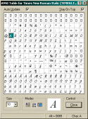
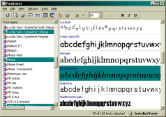
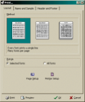
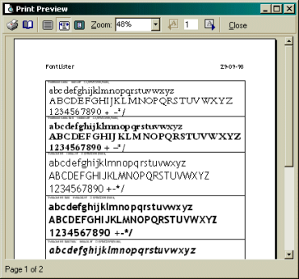
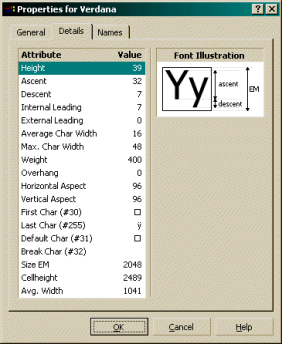
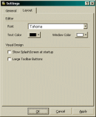

## FontLister

In my early years I was interested in fonts and used a lot of times finding the best one for my web sites. Since it wasn’t possible to test out paragraphs of text easily I created FontLister allowing me to test a full paragraph of text with all fonts installed.

After releasing version 1.0 I got a lot of requests and I started adding more and more features over the coming years. Originally priced at $5 bucks it was a real bargain since most other competitors were either really bad or priced 10x my price.

After a couple of versions FontLister was able to manage both ATM and TTF formats, had several view modes for showing installed fonts, character glyph inspectors as well as extensive support for printing and previewing “font books”.

 
